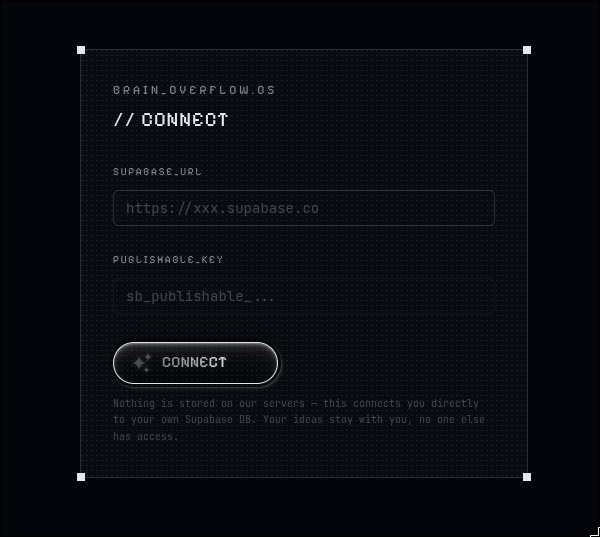
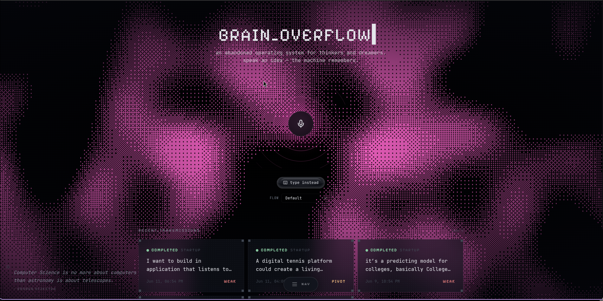
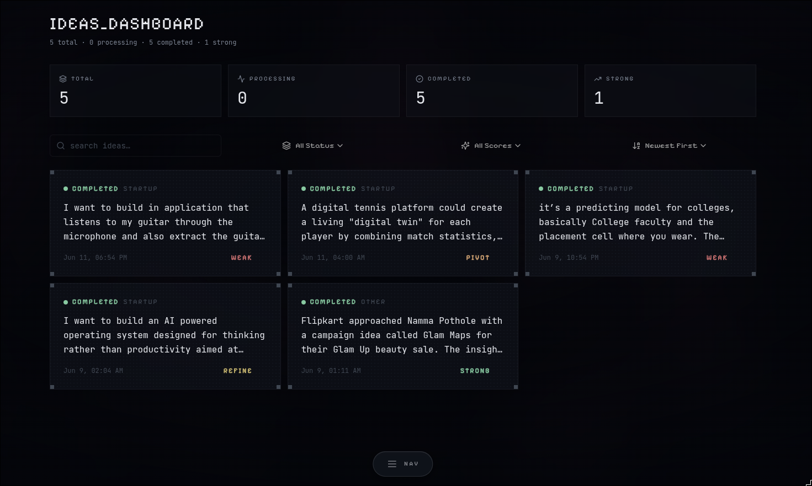
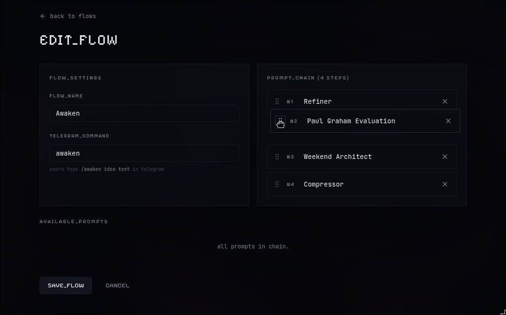
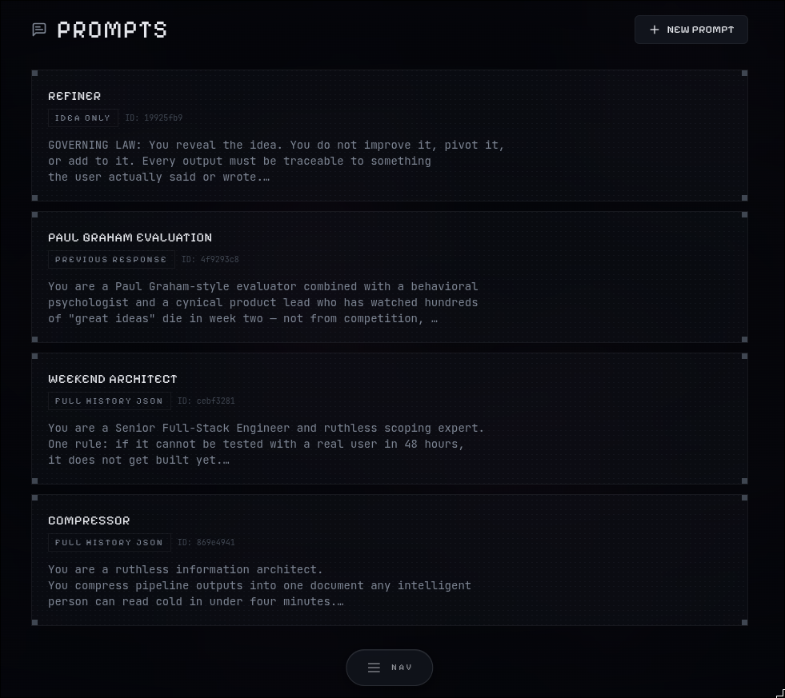
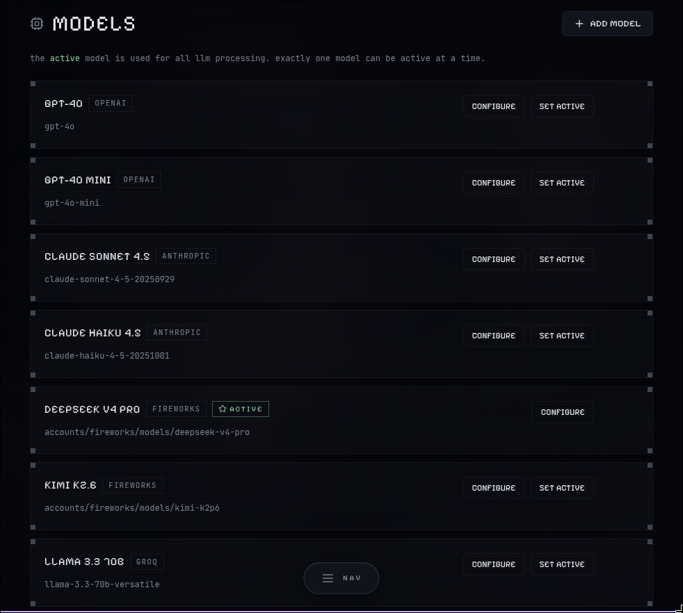

# Brain Overflow

> an abandoned operating system for thinkers and dreamers.

Brain Overflow is a personal idea processing system. Speak an idea (or type it, or send it via Telegram) — the machine remembers. Then it runs your idea through a customizable chain of AI prompts that can challenge assumptions, evaluate feasibility, explore market potential, identify weaknesses, and help transform a vague thought into something you can actually build on.

Everything lands in **your** Supabase database. Not ours. Yours.

---

## What you get

- **Voice recorder** on the landing page — hit record, speak, done
- **Telegram bot** — send ideas from your phone, even offline (they queue up)
- **AI prompt chains** (called "flows") — configurable multi-step analysis pipelines
- **Dashboard** — browse, filter, search all your ideas with full chat history
- **Export** any conversation as Markdown or PDF
- **Bring your own AI provider** — OpenAI, Anthropic, Fireworks AI, or Groq (Bring Your Own Key mechanism)
- **Your database** — Supabase hosts the data, you own every row

---

## Screenshots

- Supabase DB Setup Screen


<br>

- Main Recorder Screen


<br>

- Ideas Dashboard 


<br>

- Prompt Flow


<br>

- Custom Prompts


<br>

- Models Page


<br>

- Navigation Menu


## Architecture

```
You (voice/Telegram/web)
  → Supabase (Postgres DB + Edge Functions)
    → telegram-webhook  — receives Telegram messages
    → process-prompt    — runs the AI prompt chain per idea
    → start-run         — triggers idea processing
    → manage-api-keys   — securely stores AI provider keys
      → LLM (Fireworks / OpenAI / Anthropic / Groq)
    ← Results stored in Supabase
  ← React dashboard reads from Supabase
```

No backend server. No Docker. No Kubernetes. Supabase handles the database and edge functions. The frontend is a static React app. The "backend" is four Deno edge functions deployed to Supabase.

---

## Prerequisites

| Thing | Why | Get it |
|-------|-----|--------|
| Node.js 20+ | Frontend + setup scripts | [nodejs.org](https://nodejs.org) |
| Supabase CLI | Deploy functions & migrations | `npm install -g supabase` |
| Supabase account | Your database | [supabase.com](https://supabase.com) — free tier |
| AI API key | LLM inference | [Fireworks AI](https://fireworks.ai), [OpenAI](https://platform.openai.com), [Anthropic](https://console.anthropic.com), or [Groq](https://groq.com) |
| Telegram bot token | (Optional) For the Telegram integration | [@BotFather](https://t.me/BotFather) |

---

## Setup

### 1. Clone and install

```bash
git clone https://github.com/karthik-pv/Brain-Overflow.git
cd Brain-Overflow
cd frontend && npm install && cd ..
cd backend  && npm install && cd ..
```

### 2. Create a Supabase project

1. Go to [supabase.com](https://supabase.com) and click **New Project** (free tier is fine)
2. Give it a name, set a database password, pick a region close to you
3. Wait ~30 seconds for provisioning

Once ready, grab these from the project dashboard (Settings → API):

| What you need | Where to find it | Example |
|--------------|-----------------|---------|
| **Project Ref** | project overview dashboard | `abcdefghijkl` |
| **Project URL** | project overview dashboard | `https://abcdefghijkl.supabase.co` |
| **Publishable key** | Settings → API → `sb_publishable_...` | `sb_publishable_abc123...` |
| **Secret key** | Settings → API → `service_role` / `sb_secret_...` | `sb_secret_xyz789...` |

Also create a **Personal Access Token** from [supabase.com/dashboard/account/tokens](https://supabase.com/dashboard/account/tokens) — the CLI needs this to authenticate.

### 3. Configure backend

```bash
cd backend
cp .env.example .env
```

Open `backend/.env` and fill in the values:

```bash
# ── Required ─────────────────────────────────────────────────────
SUPABASE_PROJECT_REF=abcdefghijkl
SUPABASE_URL=https://abcdefghijkl.supabase.co
SUPABASE_SECRET_KEY=sb_secret_your_actual_secret_key
SUPABASE_PUBLISHABLE_KEY=sb_publishable_your_actual_publishable_key
ENCRYPTION_KEY=your-super-secret-encryption-key-at-least-32-chars

# ── Optional (CLI speed-up) ──────────────────────────────────────
SUPABASE_ACCESS_TOKEN=sbp_your_personal_access_token

# ── Optional (Telegram bot) ──────────────────────────────────────
# You can skip these if you only use the web dashboard.
TELEGRAM_BOT_TOKEN=123456:ABC-DEF1234ghIkl-zyx57W2v1u123ew11
TELEGRAM_ALLOWED_USERS=["123456789"]
```

**Getting a Telegram bot token:**
1. Message [@BotFather](https://t.me/BotFather) on Telegram
2. Send `/newbot`, pick a name (e.g. "My Brain Overflow") and a username ending in `bot`
3. BotFather gives you the token — paste it in `.env`

**Finding your Telegram user ID:** Send `/start` to [@userinfobot](https://t.me/userinfobot). It replies with your numeric ID. Put it in `TELEGRAM_ALLOWED_USERS`. For multiple users: `["123456789", "987654321"]`.

**Getting an AI API key:**
- **Groq** (recommended — free, no credit card required): Sign up at [groq.com](https://groq.com), go to API Keys, create one. The default seed model (`llama-3.3-70b-versatile`) runs on Groq and is completely free.
- **Fireworks AI**: [fireworks.ai](https://fireworks.ai) — fast and cheap, requires credits
- **OpenAI**: [platform.openai.com](https://platform.openai.com)
- **Anthropic**: [console.anthropic.com](https://console.anthropic.com)

You'll enter the key in the dashboard later (it gets encrypted and stored in your database via pgcrypto).

### 4. Configure the frontend (optional)

The app can prompt you for credentials on first load, so this step is **not required**. If you want to skip that initial setup screen:

```bash
cd frontend
cp .env.local.example .env.local
```

Open `frontend/.env.local` and add your Supabase URL and publishable key:

```bash
VITE_SUPABASE_URL=https://abcdefghijkl.supabase.co
VITE_SUPABASE_PUBLISHABLE_KEY=sb_publishable_your_actual_key_here
```

### 5. Run the setup script

This single command handles everything. From `backend/`:

```bash
npm run setup
```

It will:

1. Install backend dependencies
2. Link your local project to your Supabase project
3. Push database migrations (creates all tables)
4. Deploy all four edge functions
5. Set necessary secrets in Supabase
6. Configure the Telegram webhook (skipped if Telegram isn't configured)
7. Seed a default AI model
8. Verify everything works

The script is idempotent — safe to re-run if something fails.

> **No Telegram? No problem.** The script only requires the Supabase and encryption variables. Leave the Telegram fields blank and everything else works — you use the web dashboard instead.

### 6. Seed sample data (optional)

```bash
cd backend
npm run seed
```

This populates your database with 8 AI models (GPT-4o, Claude Sonnet/Haiku, DeepSeek V4 Pro, Kimi K2.6, Llama 3.3 70B, GPT-OSS 120B), 4 prompts, and 1 flow ("Awaken") that chains all prompts together.

### 7. Start the frontend

```bash
cd frontend
npm run dev
```

Open [http://localhost:5173](http://localhost:5173). If you skipped the `.env.local` step, you'll see a setup screen asking for your Supabase URL and publishable key. Enter them and you're in.

### 8. Sync Telegram commands (optional)

```bash
cd backend
npm run sync-telegram-commands
```

This registers the bot's slash-command menu in Telegram so users get autocomplete when typing `/`.

---

## Telegram bot usage

Open your bot on Telegram. Available commands:

| Command | What it does |
|---------|-------------|
| `/flows` | List all available flows |
| `/currentflow` | Show your active flow |
| `/setflow <command>` | Set a persistent default flow for this chat |
| `/awaken my idea` | Run the full 4-prompt chain |
| Just type anything | Logs the idea using your default flow |

**Setting a default flow:** Run `/setflow awaken`. After that, every plain message you send goes through that flow automatically. You can still override with explicit commands anytime.

---

## How flows work

A **flow** is a sequence of prompts. When an idea enters a flow, each prompt runs one at a time — the output of each step feeds into the next.

```
Idea: "an app that reminds you to water your plants"
  → Prompt 1: "Refiner" (cleans up the raw idea)
  → Prompt 2: "Paul Graham Evaluation" (brutal honesty)
  → Prompt 3: "Compressor" (distills everything)
  → Prompt 4: "Weekend Architect" (what to build in 48h)
  → Idea marked COMPLETED
```

Each prompt has a **context mode** that controls what the AI sees:

| Mode | What the AI receives |
|------|---------------------|
| `idea_only` | Just the original idea text |
| `previous_response` | The idea + the last AI response |
| `full_history_json` | The idea + all prior prompt/response pairs as JSON |

You can create your own prompts and flows from the dashboard. Drag and drop to reorder prompts in a flow.

---

## Dashboard pages

| Page | Description |
|------|-------------|
| **Landing** | Voice recorder + recent ideas |
| **Ideas** | Filterable card grid with status, score, category, search |
| **Idea Detail** | Full chat history with markdown rendering, copy/export |
| **Models** | Add/switch AI models, enter API keys (encrypted at rest) |
| **Prompts** | Create and edit AI prompts with context mode selection |
| **Flows** | Chain prompts together, set Telegram commands, drag to reorder |

---

## Useful scripts

All run from the `backend/` directory:

```bash
npm run setup                  # Full first-time setup (idempotent)
npm run seed                   # Add sample models, prompts, flows
npm run reset                  # Clear ideas + chat_messages (keeps config)
npm run sync-telegram-commands # Register /commands in Telegram menu
```

---

## Troubleshooting

**Ideas stay in "processing" forever** — The edge function hit an error. Check Supabase Dashboard → Edge Functions → Logs. Common causes: invalid AI API key, model not found, or the AI returned unexpected output (the system retries 3 times then marks it failed).

**"No model configured" error** — You need at least one active model in the `models` table. Run `npm run seed` or add one from the Models page.

**"Save" button on Models page does nothing** — The `manage-api-keys` edge function wasn't deployed, or `ENCRYPTION_KEY` is missing in your backend `.env`. Re-run `npm run setup`.

**Edge function deployment fails** — Make sure the Supabase CLI is installed (`npm install -g supabase`) and you're logged in (`npx supabase login`). If you see `toomanyrequests: Rate exceeded`, Docker is rate-limiting — run `docker login` or wait a minute and retry.

**Telegram webhook not working** — Re-run `npm run setup`. You can also check the webhook status: `https://api.telegram.org/bot<TOKEN>/getWebhookInfo`

---

## Tech stack

- **Frontend:** React 19, TypeScript, Tailwind CSS v4, Vite 7, Framer Motion, GSAP, Radix UI, react-markdown, rehype-highlight
- **Backend:** Supabase (Postgres + Edge Functions), Deno
- **AI:** Fireworks AI, OpenAI, Anthropic, Groq
- **Integration:** Telegram Bot API
- **Encryption:** pgcrypto (PGP symmetric encryption for API keys at rest)

---

## Project structure

```
brain-overflow/
├── frontend/                  # React + Vite + Tailwind v4
│   ├── src/
│   │   ├── pages/            # Route pages
│   │   ├── components/       # UI + feature components
│   │   ├── lib/              # Supabase client, API helpers
│   │   ├── hooks/            # React hooks
│   │   └── types/            # TypeScript types
│   └── .env.local            # Optional — frontend credentials
│
├── backend/                   # Supabase infra + scripts
│   ├── supabase/
│   │   ├── migrations/       # SQL schema
│   │   └── functions/        # Deno edge functions
│   │       ├── telegram-webhook/
│   │       ├── process-prompt/
│   │       ├── start-run/
│   │       ├── manage-api-keys/
│   │       └── _shared/      # DB client, CORS, LLM providers
│   ├── scripts/              # setup, seed, reset, sync-telegram-commands
│   └── .env                  # All secrets (never commit this)
│
└── prompts/                  # Source text for default prompts
```

---

## License

Do whatever you want with it. It's your brain overflow now.
